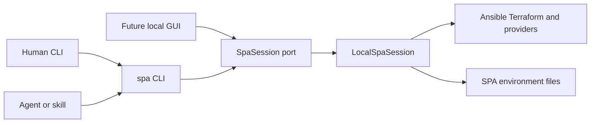
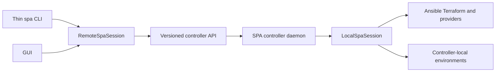

# SPA controller, GUI, and remote-client architecture

This document fixes the compatibility boundary for a future GUI and remote SPA
controller. It is a design contract, not a statement that a daemon exists
today.

## Current architecture



`lib/spa/api.py` is the backend boundary:

- `SpaSession` is the port clients depend on.
- `LocalSpaSession` is the current in-process implementation.
- Every operation returns a JSON-serializable `CommandResult`.
- `on_progress` emits JSON-serializable progress events.
- The CLI parses arguments, calls a session method, then renders human text or
  the agent JSON envelope. Business logic and confirmation enforcement belong
  in the session, not in the renderer.
- Skills and agents invoke `bin/spa`; they do not import `spa.api`.
- SSH/SCP and native discovery commands retain their documented native CLI
  output where the CLI explicitly delegates to those tools.

The stable result envelope is:

```json
{
  "ok": true,
  "schema_version": 1,
  "data": {}
}
```

Failures set `ok` to `false` and add `error`. New optional fields may be added
within the same schema version. Removing fields, changing their meaning, or
changing session method parameters requires a schema-version change and a
migration note.

## Future remote controller



Implementation sequence:

1. Add `RemoteSpaSession`, implementing the same `SpaSession` protocol.
2. Make `open_session(url=...)` select it. A later `SPA_CONTROLLER` setting can
   supply that URL; no caller should need to change session method calls.
3. Wrap one `LocalSpaSession` per request/environment in a controller service.
   Environment directories, inventories, Terraform state, installers, apps,
   Ansible, and provider credentials stay on the controller.
4. Serialize `CommandResult.to_dict()` over a versioned API. Stream
   `on_progress` events separately while preserving the final result envelope.
5. Have the CLI select local or remote sessions before dispatch. Human output
   formatting and agent JSON formatting stay in the CLI. A GUI consumes
   structured results directly.
6. Run the shared `SpaSession` contract tests against both implementations.
   Transport tests must cover success, errors, progress, cancellation,
   disconnects, timeouts, and schema-version negotiation.

`open_session(url=...)` currently raises `RemoteSessionNotImplemented`; this is
intentional so a configured remote URL can never silently execute against the
wrong local environment.

## Confirmation contract

The controller must enforce the same confirmation policy as
`LocalSpaSession`; clients cannot bypass it:

- Human CLI callers may answer a named prompt such as `destroy will permanently remove or uninstall resources. Proceed? [y/N]`.
- Agents never receive an interactive prompt and must pass `--yes`.
- A GUI displays its own approval dialog and sends `confirm=True`.
- Lifecycle operations always require confirmation.
- `spa run` uses the playbook catalog's `requires_confirmation`, failing closed
  when metadata is missing.

Approval is scoped to one request. It must not become a reusable controller
setting.

## Security requirements before remote access

- Bind to loopback only by default. Remote listening must be explicitly
  enabled.
- Require authenticated, authorized clients and environment-level access
  control. Store credentials in environment variables, an OS credential store,
  or a dedicated secret manager; never in source, URLs, command output, or
  logs.
- Require TLS 1.3 for non-loopback connections. If mutual TLS is introduced,
  verify each certificate's validity period, issuer/subject, signature
  algorithm, and public-key strength before deployment. Reject expired or
  not-yet-valid certificates, MD5/SHA-1 signatures, RSA keys below 2048 bits,
  and EC curves below P-256. Self-signed certificates are acceptable only for
  explicitly configured development/internal trust.
- Validate requested environment paths against an allowlist and prevent path
  escape. Never let a client select arbitrary controller filesystem roots.
- Preserve SPA's secret-redaction rules. Do not log environment values,
  extra-vars, credentials, license payloads, or certificate/private-key
  contents.
- Add request identity, environment, operation, targets, confirmation state,
  timestamps, and outcome to an audit log without secret values.
- Define concurrency and locking before allowing simultaneous mutations of one
  environment or Terraform state.
- Set request limits and cancellation behavior for long-running Ansible and
  Terraform operations. A client disconnect must not make operation state
  ambiguous.

Do not expose the daemon remotely until authentication, authorization,
transport security, audit logging, path isolation, and state locking all have
tests.
