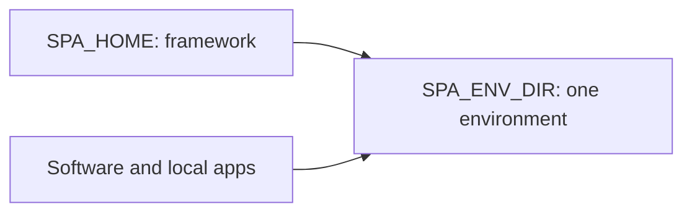
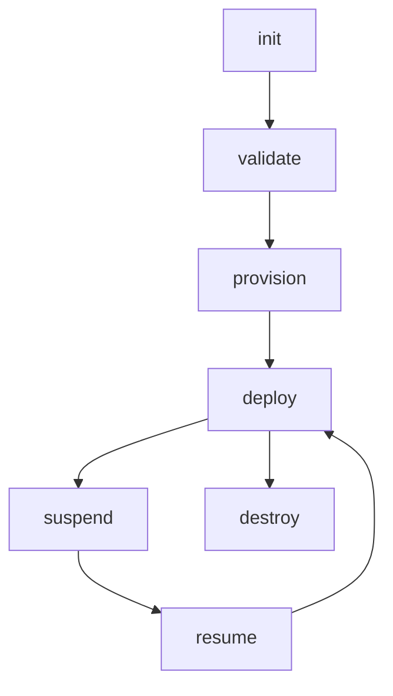
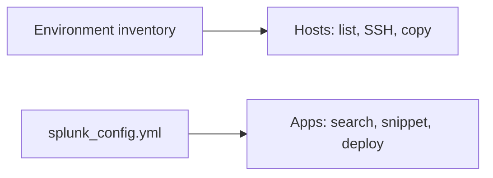

# Splunk Platform Automator user guide

SPA installs and configures Splunk Enterprise for testing, training, staging, and production. The operator interface is **`spa`**. Ansible, Terraform, and Vagrant are implementation details, not alternate operator CLIs.

## Start here

```bash
spa doctor
spa init --example cm_2idxc_sh_uf --provider aws ~/envs/my-env
cd ~/envs/my-env
spa validate
spa provision --yes && spa deploy --yes
```

Use `--provider virtualbox` with a topology such as `single_node` for local VMs. Before production, review the deployment-intent work tracked in [ROADMAP #80](../ROADMAP.md); default examples are intentionally permissive.

## Understand the paths



`SPA_HOME` is the installed framework or clone: `bin/spa`, playbooks, Terraform modules, and skills. `SPA_ENV_DIR` is one environment created by `spa init`: config, inventory, provider state, and optional `.spa.yml`. Keep Splunk installers and PS baseconfig apps in `Software/`; point local app storage at `apps_dir`.

An env created by `spa init` includes `.envrc`. If direnv is unavailable, source `$SPA_HOME/bin/spa_venv.sh` and evaluate `spa env --export`. Many environments can share one framework install.

For existing servers, describe the hosts and SSH settings in `splunk_config.yml`, then use `spa deploy --yes --allow-unprovisioned`. Use that bypass only when you intentionally did not provision those hosts with SPA.

## Configure an environment

`$SPA_ENV_DIR/config/splunk_config.yml` is the source of truth. Start from a composed topology and provider rather than copying a large example:

```bash
spa init --list
spa features search cluster
spa features show setting.idxcluster --keys
spa validate
```

The Pydantic schema enforced by `spa validate` owns types and allowed values. The feature catalog owns decision guidance and snippets. Use `spa aws --json` for live regions, AMIs, instance types, and network values; use `spa licenses` and `spa validate --check-licenses` for license selection. Until `spa config` is implemented, merge snippets into the YAML by hand.

Universal-forwarder outputs always go to all indexers today. UF → heavy forwarder (or a single indexer) is not a config knob; see `spa features show setting.outputs` and [ROADMAP](../ROADMAP.md).

## Run the lifecycle



| Job | Command |
| --- | --- |
| Create compute and inventory | `spa provision --yes` |
| Install or reconcile Splunk | `spa deploy --yes` |
| Limit a supported operation | `--hosts HOST_OR_ROLE` |
| Stop compute and retain disks | `spa suspend --yes` |
| Start compute | `spa resume --yes` |
| Remove managed infrastructure | `spa destroy --yes` |
| Discover other playbooks | `spa run --list` |
| Inspect a playbook | `spa run NAME --help` |

Provider selection comes from `terraform.aws` or `virtualbox:` in config. Do not remove a live host from config and run `spa provision`; the current Terraform flow can terminate it. See [AWS](aws.md) for cloud decisions and [Upgrade](upgrade.md) for the ordered distributed-upgrade workflow.

## Work with hosts and apps



Open `$SPA_ENV_DIR/config/index.html` after deploy for Splunk Web links. Use:

```bash
spa hosts list --status
spa hosts ssh HOST
spa hosts copy SOURCE HOST:DESTINATION
```

VirtualBox images normally log in as OS user `vagrant`; Splunk runs as OS user `splunk`. The former is an account name, not an instruction to call the Vagrant CLI.

Find application metadata and generate config without maintaining an app-ID table in docs:

```bash
spa --json apps search QUERY
spa apps snippet APP_ID
spa apps download APP_ID --yes
spa deploy --yes
```

See [Apps](apps.md) for SPA routing, customizations, ITSI, removal, and verification.

## Protect secrets

Use `lookup('env', 'NAME')` or quoted Ansible Vault values; never commit plaintext credentials. Agents report variables as set/not set and never print values. See [Secrets](secrets.md).

## Where to go next

- [Install](install.md): install, uninstall, VirtualBox, WSL2
- [Apps](apps.md): routing and app lifecycle
- [AWS](aws.md): AWS and Terraform through `spa`
- [Upgrade](upgrade.md) and [Migrate](migrate.md)
- [Contributing](contributing.md) and [AGENTS.md](../AGENTS.md)
