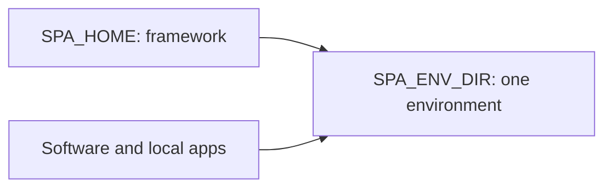
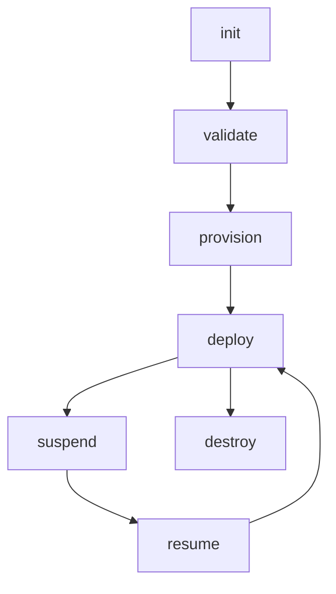
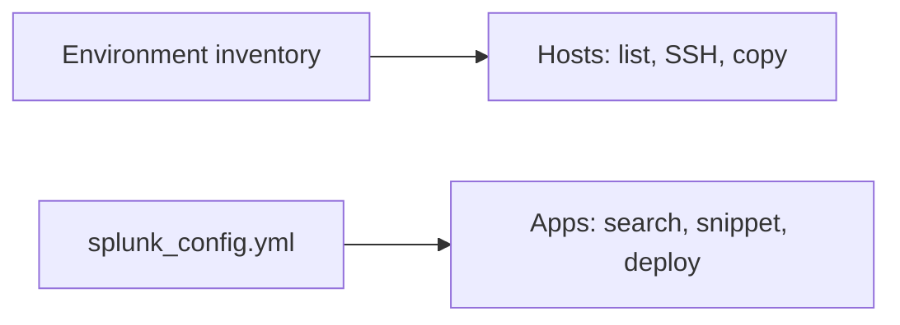

# Splunk Platform Automator user guide

SPA installs and configures Splunk Enterprise for testing, training, staging, and production. The operator interface is **`spa`**. Ansible, Terraform, and Vagrant are implementation details, not alternate operator CLIs.

## Start here

Install the framework first ([README](../README.md#install) or the commands in [install.md](install.md)), then:

```bash
spa doctor
spa init --example cm_2idxc_sh_uf --provider aws ~/envs/my-env
cd ~/envs/my-env
spa validate
spa provision --yes && spa deploy --yes
```

Use `--provider virtualbox` with a topology such as `single_node` for local VMs. Before production, review the deployment-intent work tracked in [ROADMAP #80](../ROADMAP.md); default examples are intentionally permissive.

## Understand the paths



`SPA_HOME` is the installed framework or clone: `bin/spa`, playbooks, Terraform modules, and skills. `SPA_ENV_DIR` is one environment created by `spa init`: config, inventory, provider state, and optional `.spa.yml`. Keep Splunk installers and PS baseconfig apps in `Software/`; point local app storage at `apps_dir`.

`spa` resolves an environment by `--env NAME`, `SPA_ENV_DIR`, walking up from cwd to `.spa.yml`, then the registered default, and applies that environment to the command. Many environments can share one framework install. `spa environment list` shows registered names; use `spa environment set --default NAME` for commands run outside an env, or pass `spa --env NAME`. An older lab that already has `config/splunk_config.yml` or `.spa.yml` is registered with `spa env init NAME --force` from that directory or its parent (config is kept unless you also pass `--example`).

For existing servers, describe the hosts and SSH settings in `splunk_config.yml`, then use `spa deploy --yes --allow-unprovisioned`. Use that bypass only when you intentionally did not provision those hosts with SPA.

## Prepare Software

Keep Splunk installers, Professional Services baseconfig apps, and license files **out of** `SPA_HOME`. Point every env at one shared directory:

```bash
spa init --software-dir ~/Software --example cm_2idxc_sh_uf my-lab
```

`spa validate` and `spa deploy` fail if that directory is missing or incomplete.

1. Create a directory, typically `~/Software` (not inside `SPA_HOME`).
2. Download Linux **tgz** installers and put them in that directory:
   - [Splunk Enterprise](https://www.splunk.com/en_us/download/splunk-enterprise.html)
   - [Splunk Universal Forwarder](https://www.splunk.com/en_us/download/universal-forwarder.html)
   - Filenames look like `splunk-<version>-<build>-linux-amd64.tgz` and `splunkforwarder-<version>-<build>-linux-amd64.tgz`. The version must match `splunk_version` in config.
3. Copy Splunk **Professional Services Best Practices baseconfig apps** into the same tree and extract them. They are not a public Splunk.com download. Splunk / Cisco employees can download them from [https://go2.cisco.com/baseconfigs](https://go2.cisco.com/baseconfigs). Everyone else: contact Splunk Professional Services. Typical layout: `Configurations - Base` and `Configurations - Index Replication`.
4. If you have a Splunk license, place or symlink it as **`Splunk_Enterprise.lic`** in that directory (`spa licenses` lists basenames for config). Trial-only labs can omit licenses.

```text
~/Software/Configurations - Base/...
~/Software/Configurations - Index Replication/...
~/Software/splunk-<version>-<build>-linux-amd64.tgz
~/Software/splunkforwarder-<version>-<build>-linux-amd64.tgz
~/Software/Splunk_Enterprise.lic
```

User-level defaults live in `~/.config/spa/paths.yml` (not secrets). `spa environment set --env-dir DIR` changes the parent for name-only init (omit when it is `~/Splunk-Platform-Automator`). `spa environment set --software-dir DIR` / `--baseconfig-dir DIR` / `--apps-dir DIR` set the shared installer, PS baseconfig, and local-apps trees for every env. `--software-dir` also sets `baseconfig_dir` when you do not pass `--baseconfig-dir`. If a path key has never been set, `spa init` stores the first directory it is given or discovers; later one-off init options remain specific to that env and do not replace an established global. `spa environment set --default NAME` selects a registered environment. `spa environment set --provider virtualbox` writes `~/.config/spa/providers.yml`; aws is the implicit default and does not create that file. One-off dest (`spa init /my/custom/folder/my-lab` or `--env-dir` + `--name`) does not change the default parent.

Later per-env knobs on `spa environment set --env NAME` will write that env’s `.spa.yml`, not `paths.yml`.

## Configure an environment

`$SPA_ENV_DIR/config/splunk_config.yml` is the source of truth. Start from a composed topology and provider rather than copying a large example:

```bash
spa init --list
spa features search cluster
spa features show setting.idxcluster --keys
spa validate
```

The Pydantic schema enforced by `spa validate` owns types and allowed values. The feature catalog owns decision guidance and snippets. Use `spa aws --json` for live regions, AMIs, instance types, and network values; use `spa licenses` and `spa validate --check-licenses` for license selection. Until `spa config` is implemented, merge snippets into the YAML by hand.

Universal-forwarder outputs always go to all indexers today. UF → heavy forwarder (or a single indexer) is not a config knob; see `spa features show setting.outputs` and [ROADMAP](../ROADMAP.md).

## Run the lifecycle



| Job | Command |
| --- | --- |
| Create compute and inventory | `spa provision --yes` |
| Install or reconcile Splunk | `spa deploy --yes` |
| Limit a supported operation | `--hosts HOST_OR_ROLE` |
| Stop compute and retain disks | `spa suspend --yes` |
| Start compute | `spa resume --yes` |
| Remove managed infrastructure | `spa destroy --yes` |
| Discover other playbooks | `spa run --list` |
| Inspect a playbook | `spa run NAME --help` |
| Show a run transcript | `spa logs` / `spa logs --last` / `spa logs --follow` |
| Ansible/Terraform-style replay (redacted) | `spa logs --last --ansible-output` |
| Redacted Ansible-style output during a run | `spa deploy --yes --ansible-output` |
| Ansible's own output for debugging (unredacted, may show credentials) | `spa deploy --yes -v` (Ansible verbosity: `-- -vv`) |
| Create or repair the Python venv | `spa venv --shared --create --yes` (see [install](install.md) for `--upgrade` / `--rebuild`) |

Provider selection comes from `terraform.aws` or `virtualbox:` in config. Do not remove a live host from config and run `spa provision`; the current Terraform flow can terminate it. See [AWS](aws.md) for cloud decisions and [Upgrade](upgrade.md) for the ordered distributed-upgrade workflow.

Mutating Ansible/Terraform work writes a redacted JSONL transcript under `$SPA_ENV_DIR/logs/` (local timestamps with a numeric offset). On a TTY, humans see **one live line per named group that actually runs** (for example `Deploy  App deployment · Search Head Cluster apps`), with counters updating in place. There is no `[3/10]` index; unused topology simply never appears. `spa run` of the same first-party playbooks (including upgrades) uses the same titles with a `Run` prefix. Failures print immediately. `NO_COLOR` / piped stderr stay uncolored. Agents keep a small JSON envelope on stdout plus `data.log`; they must not ingest the transcript unless you asked to debug a failure. Terraform instance changes (`instance_type`, disk) fold into the provision plan/apply line.

## Work with hosts and apps



Open `$SPA_ENV_DIR/config/index.html` after deploy for Splunk Web links. Use:

```bash
spa hosts list --status
spa hosts ssh HOST
spa hosts copy SOURCE HOST:DESTINATION
```

VirtualBox images normally log in as OS user `vagrant`; Splunk runs as OS user `splunk`. The former is an account name, not an instruction to call the Vagrant CLI.

Find application metadata and generate config without maintaining an app-ID table in docs:

```bash
spa --json apps search QUERY
spa apps snippet APP_ID
spa apps download APP_ID --yes
spa deploy --yes
```

See [Apps](apps.md) for SPA routing, customizations, ITSI, removal, and verification.

## Protect secrets

Use `lookup('env', 'NAME')` or quoted Ansible Vault values; never commit plaintext credentials. Agents report variables as set/not set and never print values. See [Secrets](secrets.md).

## Where to go next

- [Commands](commands.md): generated CLI catalog (`spa agent schema --markdown`)
- [Install](install.md): install, uninstall, VirtualBox, WSL2
- [Apps](apps.md): routing and app lifecycle
- [AWS](aws.md): AWS and Terraform through `spa`
- [Upgrade](upgrade.md) and [Migrate](migrate.md)
- [Contributing](contributing.md) and [AGENTS.md](../AGENTS.md)
