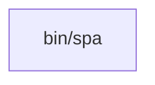

# Fixture: skipped fence then a later stale inline command

A mermaid fence must not desync later inline backtick pairing:

```mermaid
flowchart LR
    spaBinary["bin/spa"]
```

Do not copy `spa aws regions list`.
